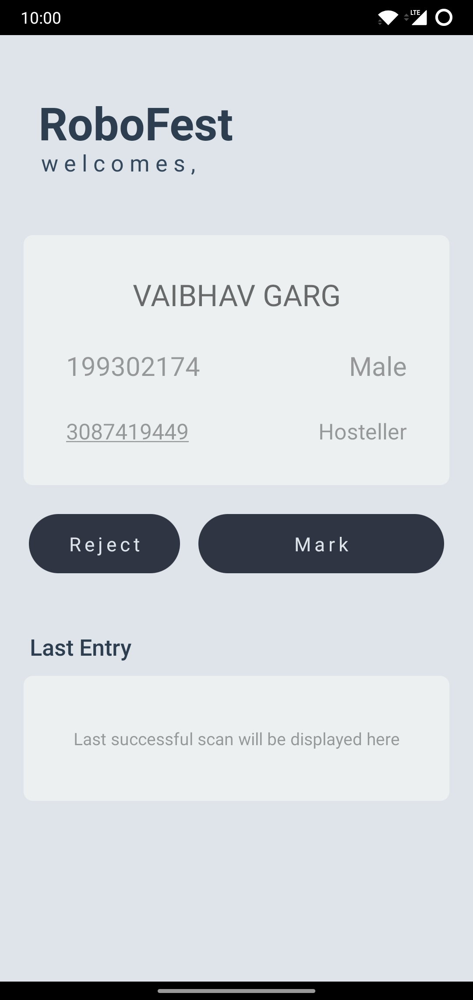
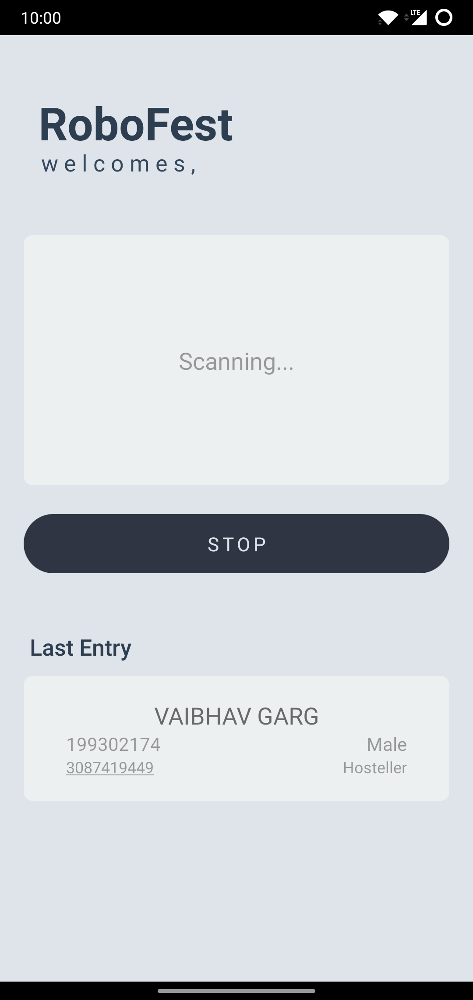
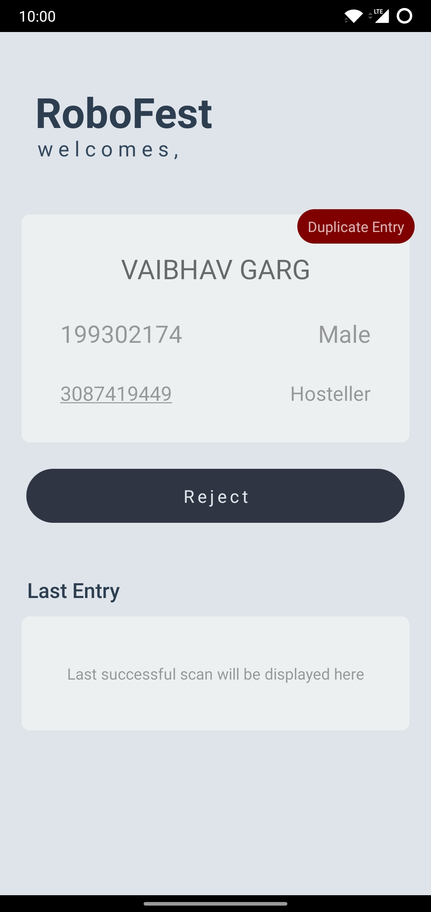

 

  <a href="https://github.com/21vaibhavgarg/nfc-entry">

  <h2 align="center">NFC Entry</h2>
  </a>
   
  
NFC based attendance recording app for offline events.

  
  
  

  

    Capture proof of presence in offline events using NFC enabled ID Cards and a smartphone.
     
    <a href="https://github.com/21vaibhavgarg/nfc-entry/issues">Report Bug</a>
    or
    <a href="https://github.com/21vaibhavgarg/nfc-entry/issues">Request Feature</a>
  

  
Table of Contents

  <ol>
    <li>
      <a href="#problem">Problem</a>
    </li>
    <li><a  href="#challenges">Challenges</a></li>
    <li><a href="#technologies-used">Technologies Used</a></li>
    <li><a href="#contact">Contact</a></li>
  </ol>

### Problem

#### Why?

After the pandemic, transitioning from online to offline events is a whole lot of manual work. One of the issues is recording the presence of students manually before giving entry to an event which can be hard and time consuming. And this may result in crowding and a bad experience for the attendees as well as the organizing committee.

#### What does the app do?

- Enables the organizers to record the presence of attendees by using the pre deployed NFC based ID cards system.
- All the entries are stored in a Google Sheet in real time.
- Duplicate entries for same event is detected and alerted to avoid unauthorized entries.
- Multiple entry points with a shared database is supported to avoid duplicacy.

### Screenshots

### Challenges

- Google Sheet package has some dependency modules which are built-in Node modules and React Native runs JS on JavaScriptCore, therefore Google Sheet package would not work directly from a React Native app. The better approach followed here is to write all the logic on the Node server end and make the client app as dummy as possible.
- When you are working with NDEF data that Android cannot fully understand, you have to manually read or write to the tag in raw bytes using your own protocol stack. All the data related to a card is stored in the database and mapped to the UID on the RFID tag.
- Showing an alert for the duplicate ID cards used to scan for the same event which can be helpful removing unauthorized access to the event and duplicate entries in the Google Sheet.

### Technologies Used

#### Frontend

- [React Native](https://reactnative.dev/)
- [React.js](https://reactjs.org/)

#### Backend

- [Node.js](https://nodejs.org/en/)
- [Express.js](https://expressjs.com/)
- [PostgreSQL](https://www.postgresql.org/)
- [Supabase](https://supabase.com/)
- [Google Sheets](https://www.google.com/sheets/about/)

#### Language

- [Typescript](https://www.typescriptlang.org/)
- [Javascript](https://developer.mozilla.org/en-US/docs/Web/JavaScript)
   

### Contact

- [Vaibhav Garg](https://www.linkedin.com/in/vaibhavgarg24/)
